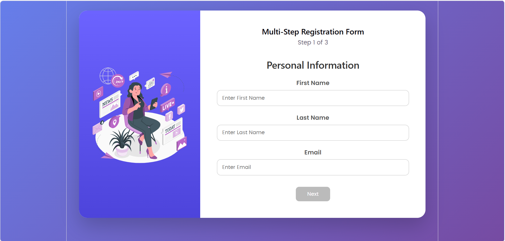

# Multi-Step Registration Wizard 🚀

A modern multi-step onboarding form built with React. This project demonstrates structured user data collection using a step-based form flow, validation, and responsive UI design.

Live website Link: https://multi-step-registration-wizard-five.vercel.app/

## ✨ Features

- Multi-step registration workflow
  - Personal Information
  - Account Details
  - Review & Submit

- Form state management using React Hook Form
- Schema validation using Zod
- Real-time field validation
- Show/Hide password toggle
- Progress indicator
- Data persistence while navigating between steps
- Review page before final submission
- Success confirmation screen with animation
- Fully responsive design for desktop and mobile devices

## 🛠️ Tech Stack

- React.js
- React Hook Form
- Zod
- Vite
- CSS3
- JavaScript ES6+

## 🤖 AI Usage

AI assistance was used during the development process for:

- Debugging issues related to React form flow and component behavior
- Getting suggestions for UI color combinations and styling improvements

All final implementation decisions, code integration, and project development were done by the developer.

## 📸 Screenshot

